# Openscad housings for BananaPro, Tanix TX3, TX6

This is WIP, though I printed and used various housings with good success.
Documentation needs quite some work and I do not have the time to write it.

No Warranties of any Kind, Licence: GPL3.
If you find erorrs, have improvements, PRs are very welcome.

(Openscad is a programming language/tool to create .stl files for 3D printing.)

Find .stl and png files:
- BananaPro
	- BananaPro/STL:
	- BananaPro/PNG
- Tanix TX3, TX6
  - TX6/STL
  - TX6/PNG

### A few Examples:

#### BananaPro:

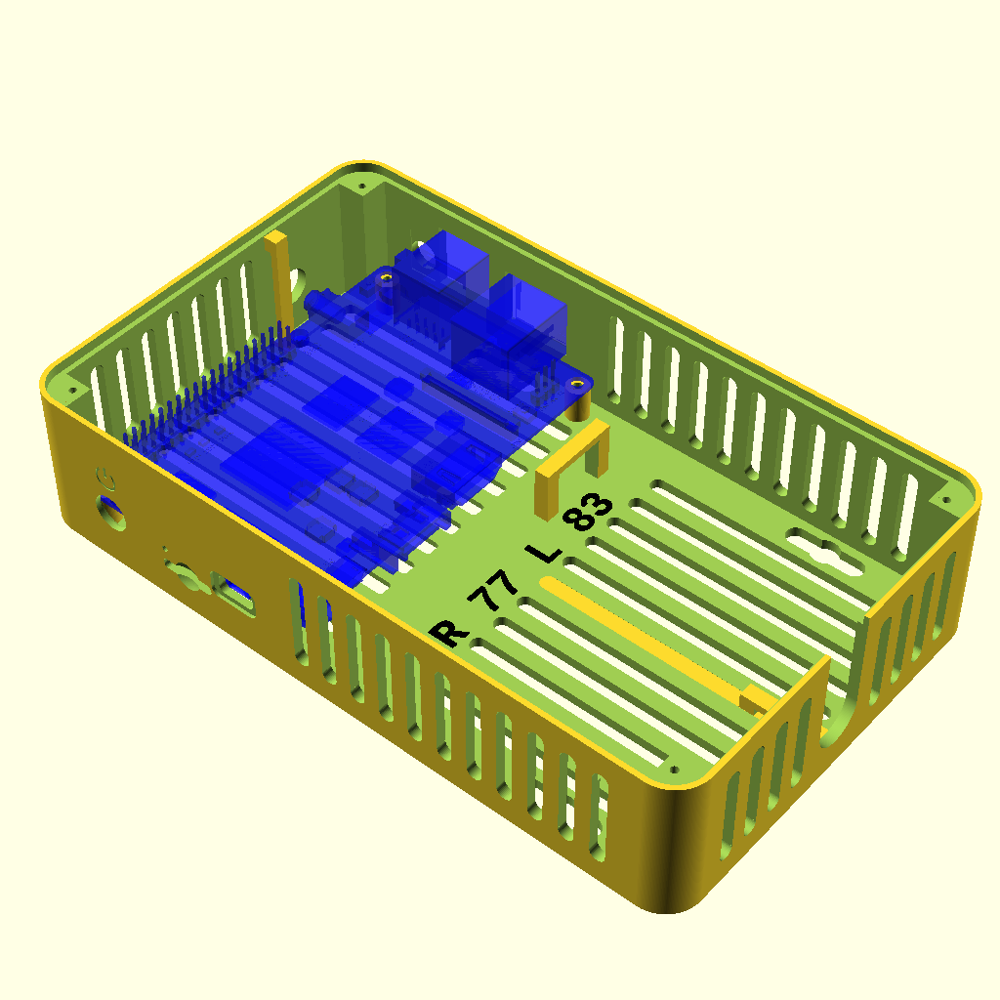
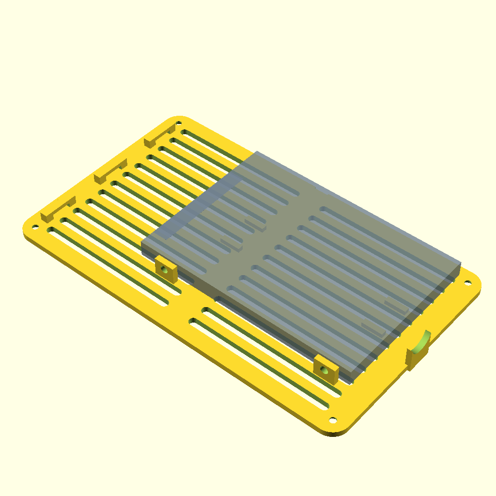
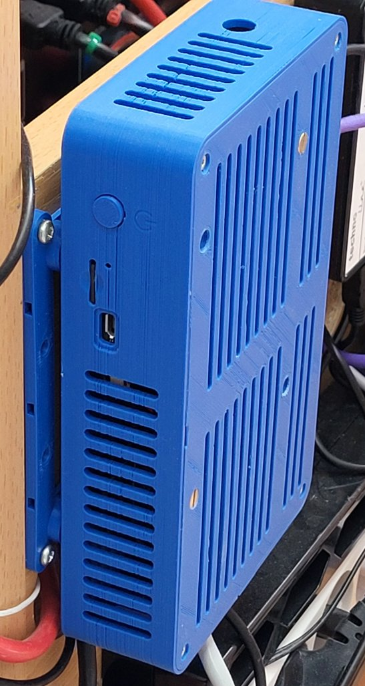

#### Tanix TX6:
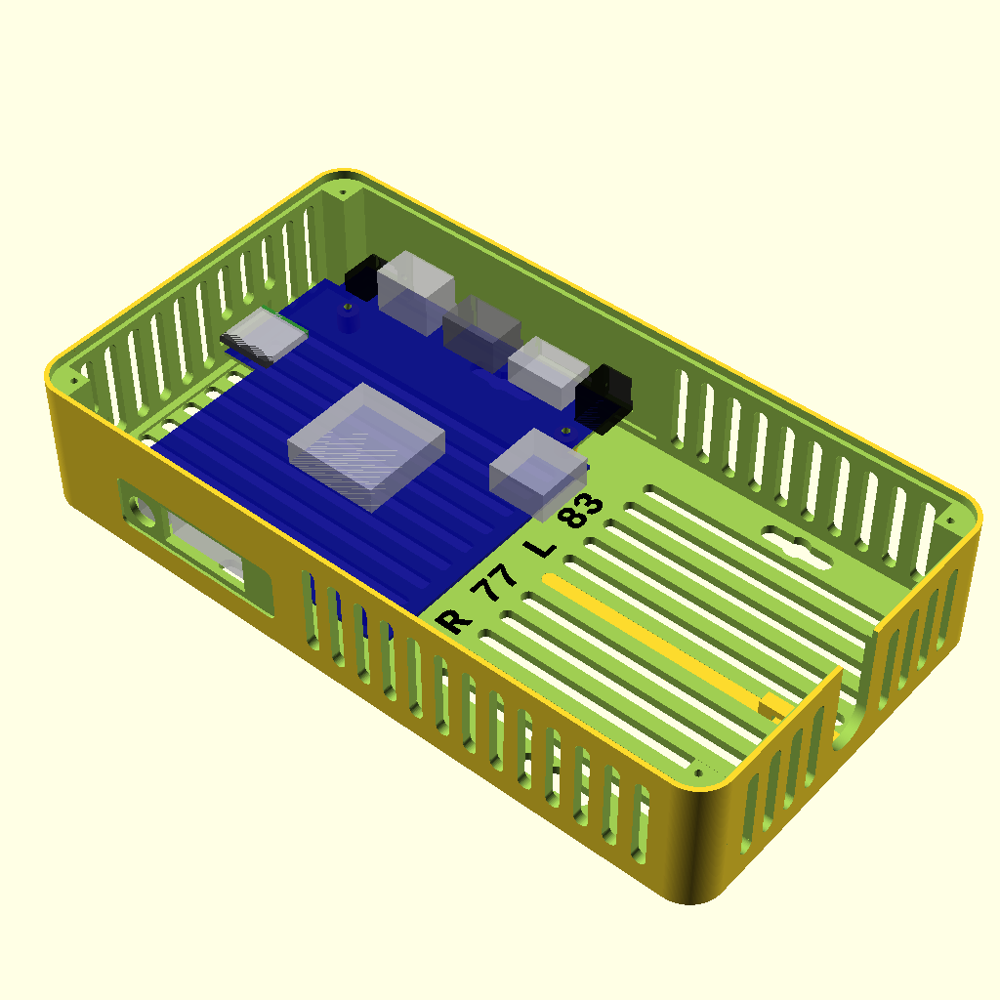
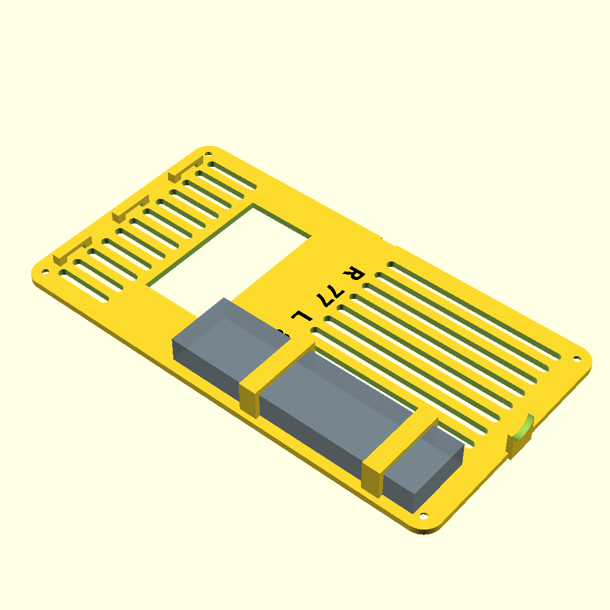

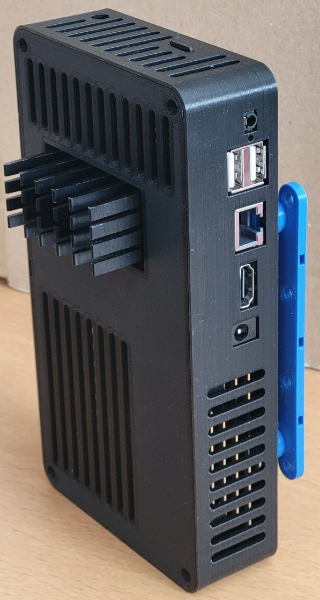
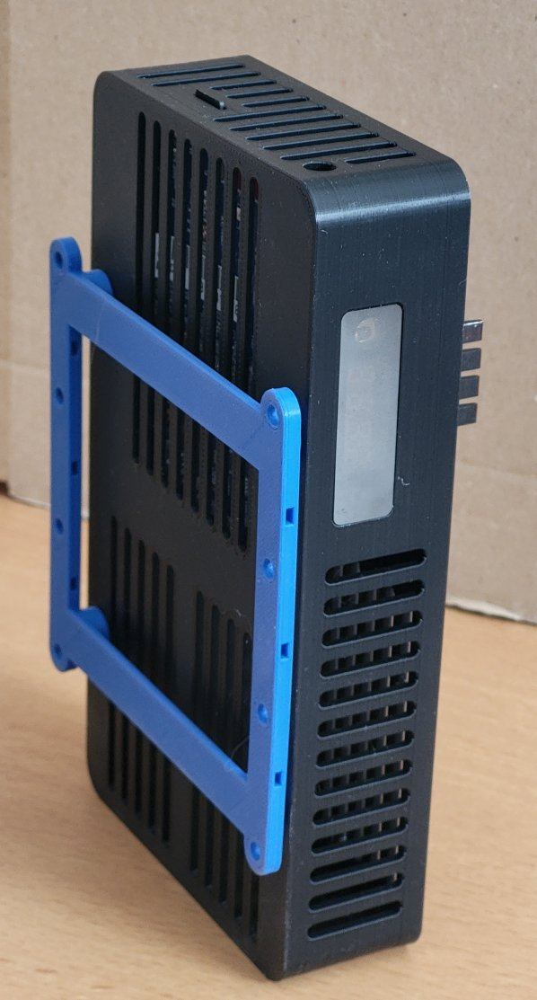
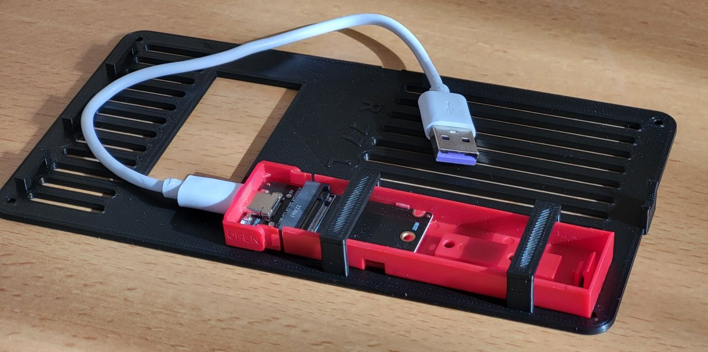
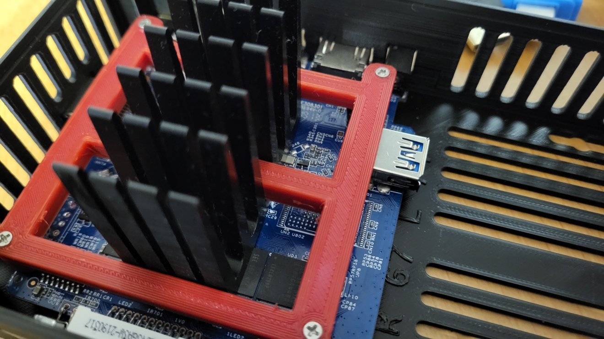
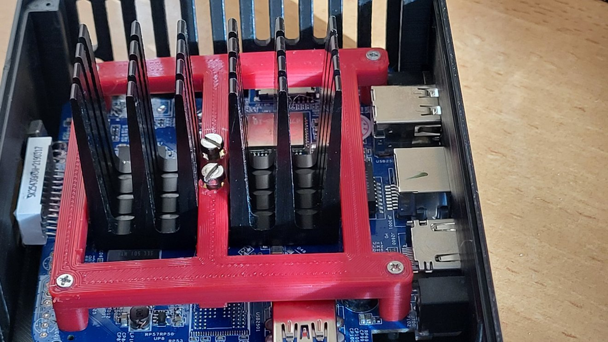
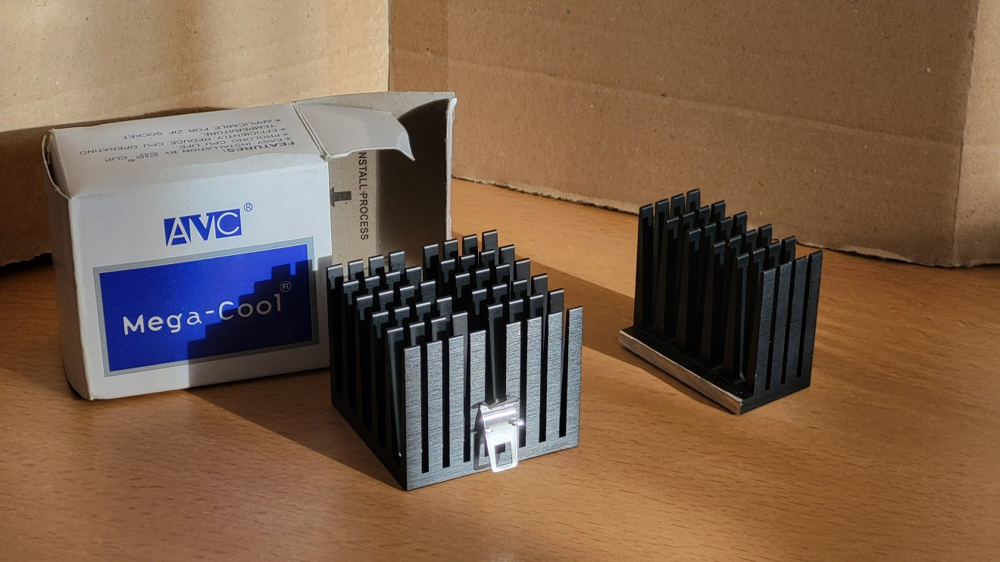

#### Tanix TX3:
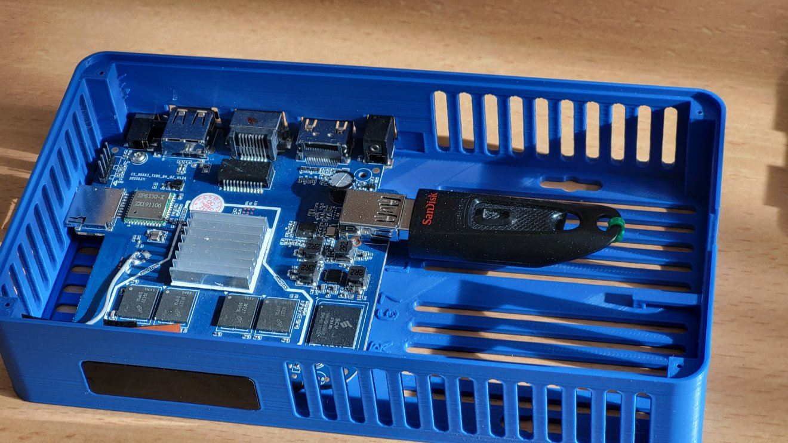

#### Vesa 100 Holder:
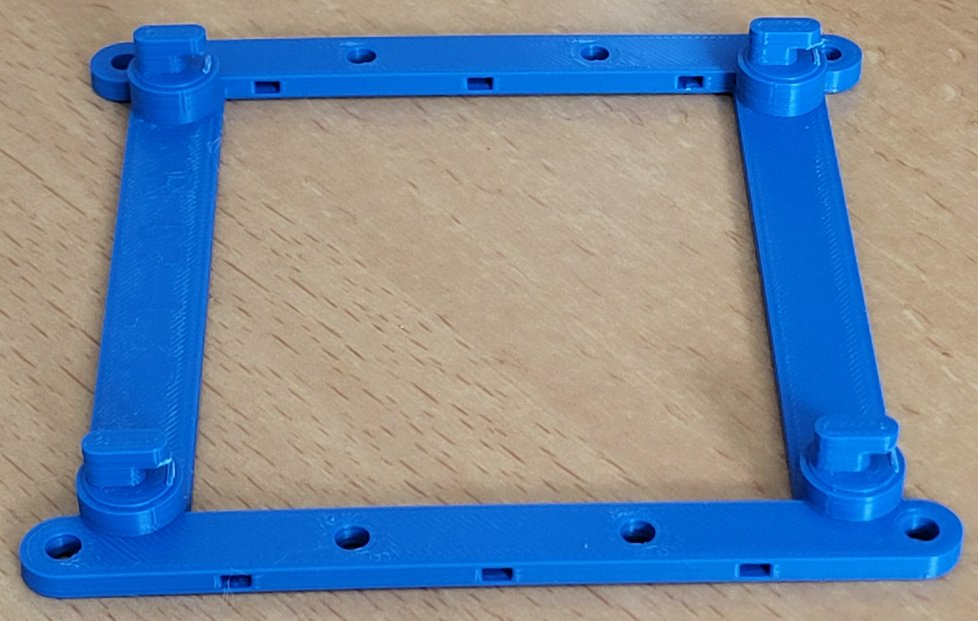

#### Vesa 200/400 Holder:
Design is in the sources, but currently I do not have images.

### Notes
- The heatsink is a ~half of an off the self heatsink I had here. These are 53mm square.
- I did not check whether the heatsink holder would also fit for the TX3. Let me know if you want this.
## Print details
On my Ender 3 V2 the body takes about 11.x hours with 0.2mm layer height.
The cover took about 5 hours from my recall.

Print the heatsink holder with PETG or better. PLA would probably get weak at the normal temperatures.
The rest I printed with PLA, 50% infill
## Build details
Best is to build with makefiles. These produce the various .stl and .png files.
You can also generate the .stl from inside the openscad, though I do not recommend this.

I use the .json files to stear the makefiles which output gets produced. I am too, lazy to do all this by hand in openscad. It will generate all the .stl (.png) in the STL/PNG dirs.

Take a break, building takes some time.
#### BananaPro
Navigate to dir BananaPro and run make.

#### TX3 and TX6
Navigate to dir TX6 and run make.

### Details on the Makefile
    It parses the json file to get the list of things/flavours to build.
    Then it creates pictures in PNG directory and the stl in STL.

    It also checks for a template file (svn_rev.tmpl) and calls SubWCRev to create svn_rev.scad. 
    I do not provide the template file, so this rule will not execute on your machine (I provide the svn_rev.scad instead).

    You might also notice that it checks for my library dfLibscad. If found, the libraries tmpl file gets translated into another scad file with a version string of the library.

    I use this Makefile in other projects as well, just the very few first lines need to be adjusted.
    Feel free to reuse it.
